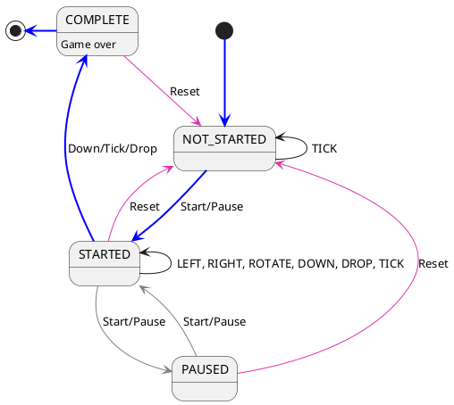

# Finite State Machine

## States
* NOT_STARTED
* STARTED
* PAUSED
* COMPLETE

## Events
* Left
* Right
* Rotate
* Down
* Drop
* Start/Pause
* Tick
* Reset

## Finite State Machine

```plantuml
@startuml

[*] -[#blue,bold]-> NOT_STARTED
NOT_STARTED -left-> NOT_STARTED: TICK

NOT_STARTED -[#blue,bold]down-> STARTED: Start/Pause
  STARTED -[#gray]-> PAUSED: Start/Pause
  PAUSED -[#gray]-> STARTED: Start/Pause
STARTED -[#blue,bold]-> COMPLETE: Down/Tick/Drop

STARTED -up-> STARTED: LEFT, RIGHT, ROTATE, DOWN, DROP, TICK

STARTED -[#DD33AA]left-> NOT_STARTED: Reset
PAUSED -[#DD33AA]-> NOT_STARTED: Reset
COMPLETE -[#DD33AA]-> NOT_STARTED: Reset

COMPLETE -[#blue,bold]left-> [*]
COMPLETE: Game over

@enduml
```