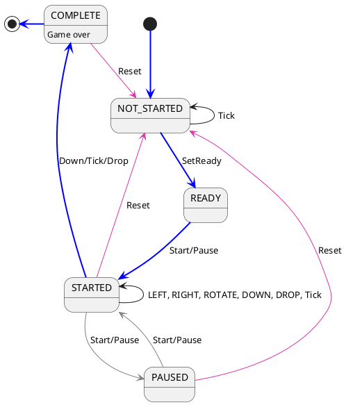

# Finite State Machine

## States
* NOT_STARTED
* READY
* STARTED
* PAUSED
* COMPLETE

## Events
* SetReady
* Left
* Right
* Rotate
* Down
* Drop
* Start/Pause
* Tick
* Reset

## Finite State Machine

