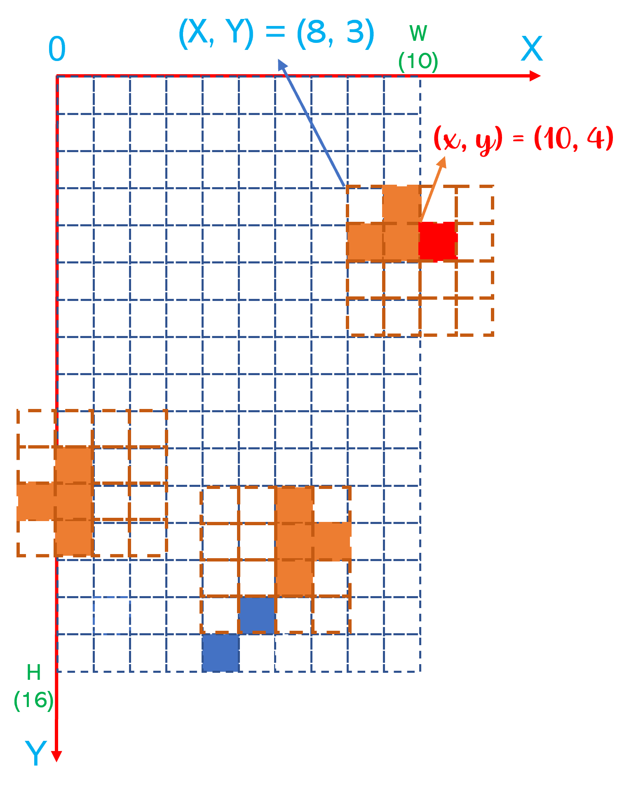

# Piece Move

## Coordinate System
Different to the traditional coordinate system, 0 is on the top-left corner.

Please check the image below.

## Collision Detections

Collision detecions are ensuring that 
1. the piece (all occupied blocks) must be in the playfield
  * `X + x ≥ 0` for the left side
  * `X + x < W` for the right side
  * `Y + y < H` for the bottom
2. the piece (all occupied blocks) must NOT be overlapping on any occupied blocks in the playfield
  * `Field(X+x, Y+y) == 0`

> Notes:
> - W: the width of the playfield.
> - H: the height of the playfield.
> - (X, Y): the absolute position of the top-left block in the piece in the playfield. 
> - (x, y): the relative position of any block inside of the piece

